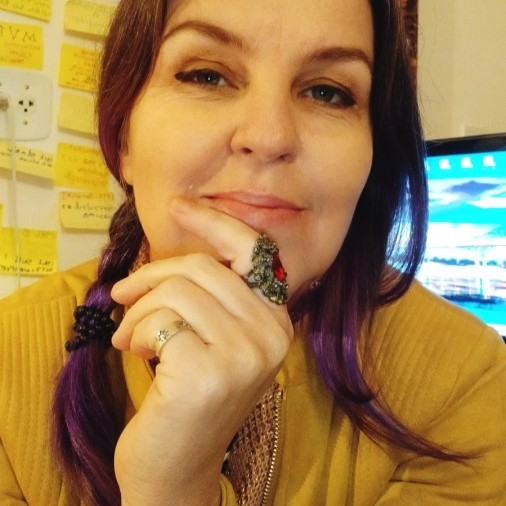

<h1 align="center">
  
  DESAFIO FRONT-END
</h1>

 Status <☕> Em desenvolvimento 06 julho 2023 <☕/>

## As decisões que eu tomei:

Pensando num MVP, no que seria possível entregar nesse espaço de tempo:
- Priorizei a reprodução fiel do layout e foquei na estilização do skin.
- Na sessão "Soluções", não desenvolvi as funcionalidades como 'search filter' + 'dropdownList' + 'pagination', porém as deixei aparente demosntrando o que poderá acontecer ali, naqueles elementos, na próxima entrega.

Como sugestão:
- Adicionei um possível menu no top Navbar, linkei os 2 btns ativos às respectivas sections;
- Alterei a cor ativa da paginação para verde, para complementar com os detalhes da imagem que vem logo abaixo;
- Add aos cards preço e stars.

 

## Como  organizei meu código:
- Dentro da pasta "Components", há uma pasta para cada sessão da página. Componentes que não são 'sessão', estão dentro da pasta "UI". 
- Na pasta "Styles" ficam as variáveis globais, comum à todos, e que são chamadas e sofrem alterações em cada arquivo SCSS. 

## As funcionalidades 
- As pastas "Filter" + "Soluctions" - assim como os arquivos "DropDownList" e "SoluctionPagnation", deveriam compor a mesma section. Que seria o ´grid de opções para escolha dos produtos e a visualização do player. Essa integração, ou uma contrução única não houve tempo pra desenvolver.

 

## As instruções de como rodar o projeto:
- 

 

## 🛠️ Tecnologias utilizadas:
- ``Typescript``
- ``React``
- ``NextJs``

 

## :octocat: Dev: 
<table>
  <tr>
    <td align="center">
      <a href="#">
         
        
          <b>Debh Valois</b>
        
      </a>
    </td>
  </tr>
</table>

